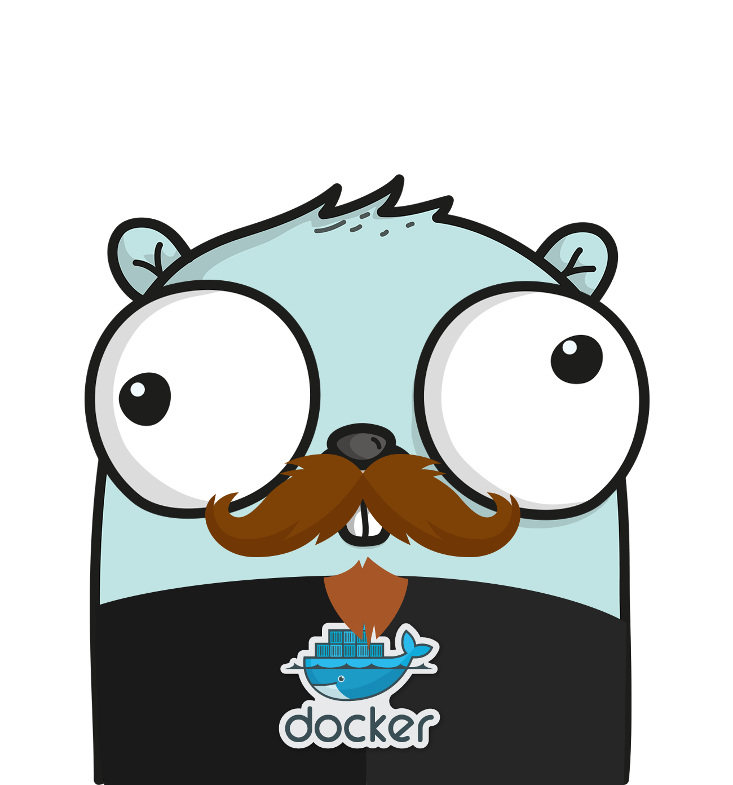

    
  
  

---

<h1 align="center">Josh Harshman</h1>

  Principal Architect & Engineering Leader • Cloud Infrastructure Specialist • Go Developer

---

### 👋 Hello

I’m Josh — a Principal Architect and Manager at **Bitly**, where I lead teams building large-scale, resilient systems.  
My background is rooted in infrastructure and backend systems — from bare-metal Linux to distributed services running in Kubernetes. I'm obsessed with clean interfaces, long-lived systems, and teams that run like well-tuned machines.

I work in **Go**, thrive in **Linux**, and design infrastructure that scales.

---

### 🔧 Core Technologies

  
  
  
  
  
  
  
  

---

### 🧠 What I Value

- Clear, opinionated design.
- Systems that shut down cleanly.
- Tracing everything.
- Automation over tribal knowledge.
- A team that owns its tools and runs its own pager.

---

### 📬 Let’s Connect

If you're building infrastructure, Go tools, or curious about how to scale teams as well as systems — feel free to [reach out](https://www.linkedin.com/in/joshuaharshman).

---

  

